# 运动健康（健康管理）应用模板快速入门

## 目录

- [功能介绍](#功能介绍)
- [约束与限制](#约束与限制)
- [快速入门](#快速入门)
- [示例效果](#示例效果)
- [开源许可协议](#开源许可协议)

## 功能介绍

您可以基于此模板直接定制应用，也可以挑选此模板中提供的多种组件使用，从而降低您的开发难度，提高您的开发效率。

本模板提供如下组件，所有组件存放在工程根目录的components下，如果您仅需使用组件，可参考对应组件的指导链接；如果您使用此模板，请参考本文档。

| 组件                                  | 描述                                                                                | 使用指导                                                  |
|:------------------------------------|:----------------------------------------------------------------------------------|:------------------------------------------------------|
| 数据看板组件（data_dashboard）            | 提供健康数据可视化展示，支持步数、心率、血压、血糖、睡眠等数据的图表展示和历史记录查看                                  | [使用指导](components/data_dashboard/README.md)       |
| 通用登录组件（aggregated_login）          | 提供华为账号一键登录及其他方式登录（微信、手机号登录），开发者可以根据业务需要快速实现应用登录                          | [使用指导](components/aggregated_login/README.md)     |
| 消息管理组件（message_manager）           | 提供消息展示、已读、未读、删除查看等功能                                                            | [使用指导](components/message_manager/README.md)      |
| 通用问题反馈组件（feedback）                | 提供通用的问题反馈功能                                                                       | [使用指导](components/feedback/README.md)             |
| 检测应用更新组件（check_app_update）        | 提供检测应用是否存在新版本功能                                                                   | [使用指导](components/check_app_update/README.md)     |
| 通用个人信息组件（collect_personal_info） | 支持编辑头像、昵称、姓名、性别、手机号、生日、个人简介等                                                    | [使用指导](components/collect_personal_info/README.md) |

本模板为健康管理类应用提供了完整的开发框架，模板主要分健康、设备和个人三大模块。

本模板主要功能模块：

* 健康：提供运动数据追踪、BMI与体脂率计算、多项健康指标监测（血糖、心率、血压、睡眠）、健康知识（30篇文章+收藏+搜索）、用药与饮水提醒、喝水打卡、健康目标设定、健康数据历史记录与周报/月报分析、数据导出、异常指标提醒、今日健康评分、连续打卡天数、健康建议、成就徽章、异常事件时间线、睡眠质量评分、BMI计算器等功能。

* 设备：提供蓝牙设备连接管理、智能设备数据同步等功能。

* 个人：提供个人信息管理、隐私设置、账号登录、意见反馈、开发者选项（Mock模式）等功能。


本模板已集成华为账号、微信登录、应用更新、消息推送等服务，采用模块化架构设计，支持多设备适配，提供完整的状态管理和路由导航解决方案，只需做少量配置和定制即可快速实现健康管理应用的核心功能。

| 健康 | 设备 | 个人 |
|:---:|:---:|:---:|
| 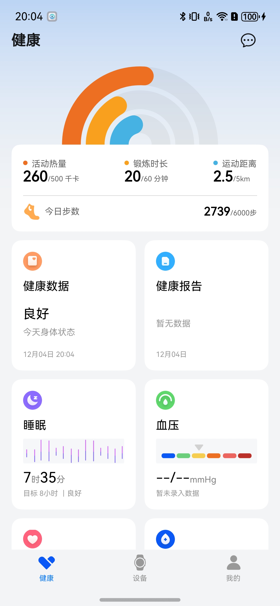 | 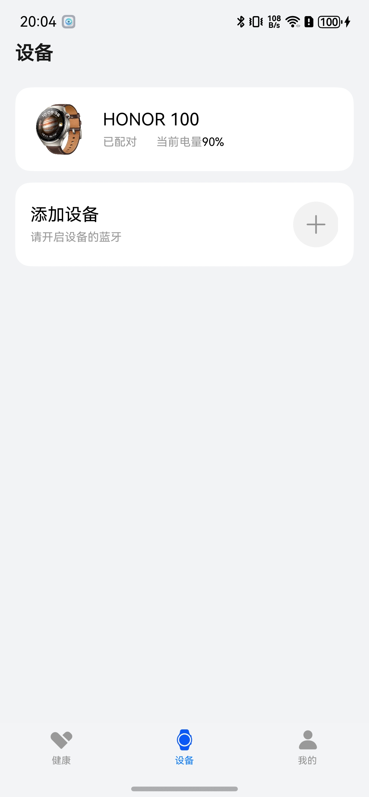 | 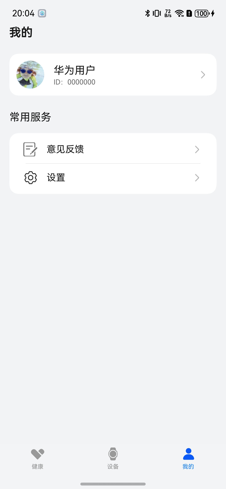 |

本模板主要页面及核心功能如下所示：

```text
健康管理模板
  ├──健康模块
  │   ├──运动数据追踪
  │   │   ├── 步数统计
  │   │   ├── 卡路里消耗
  │   │   └── 运动时长
  │   │
  │   ├──健康指标
  │   │   ├── 血糖监测（3.9-7.8mmol/L正常范围，异常弹窗提醒）
  │   │   ├── 心率监测（60-100次/分正常范围，异常弹窗提醒）
  │   │   ├── 血压监测（80-120mmHg正常范围，异常弹窗提醒）
  │   │   ├── 睡眠监测（目标8小时，质量评估）
  │   │   └── BMI 异常提醒（录入体重后自动提示偏瘦/偏胖/肥胖）
  │   │
  │   ├──数据可视化
  │   │   ├── 图表展示（周/月/季度多维度）
  │   │   ├── 趋势分析
  │   │   ├── 历史记录（按月分组，支持详情查看）
  │   │   ├── 周度报告（从历史数据动态聚合）
  │   │   └── 月度报告（从历史数据动态聚合）
  │   │
  │   ├──健康知识
  │   │   ├── 健康资讯（30篇文章，支持搜索过滤）
  │   │   ├── 收藏功能（爱心图标，本地持久化）
  │   │   ├── 每日推荐（首页每日一句卡片）
  │   │   └── 分类浏览（饮食/运动/睡眠/心理）
  │   │
  │   ├──用药与饮水提醒
  │   │   ├── 提醒计划管理（5条默认计划，支持自定义）
  │   │   ├── 定时弹窗提醒（到点自动弹出）
  │   │   ├── 打卡功能（弹窗内一键打卡，状态持久化）
  │   │   └── 打卡日历（计划页显示今日已完成状态）
  │   │
  │   ├──喝水打卡
  │   │   ├── 每日喝水进度（杯数/目标，进度条）
  │   │   ├── +1 快捷按钮（每日上限20杯）
  │   │   └── 目标自定义（4-20杯可选，持久化存储）
  │   │
  │   ├──健康目标
  │   │   ├── 目标体重设定
  │   │   └── 距目标差距展示
  │   │
  │   ├──健康评分
  │   │   ├── 今日评分（0-100，综合BMI/血压/心率/血糖/运动）
  │   │   ├── 7天评分历史
  │   │   └── 各项子评分展示
  │   │
  │   ├──健康建议
  │   │   ├── 根据当前数据动态生成个性化建议
  │   │   └── 按优先级排序展示
  │   │
  │   ├──成就徽章
  │   │   ├── 8个成就目标（打卡/饮水/运动/阅读等）
  │   │   ├── 进度追踪与解锁日期
  │   │   └── 成就详情页（2列Grid展示）
  │   │
  │   ├──异常事件
  │   │   ├── 心率/血压/血糖/BMI异常记录
  │   │   ├── 按日期分组的时间线展示
  │   │   └── 本周事件统计
  │   │
  │   ├──睡眠质量
  │   │   ├── 睡眠质量评分（基于深睡/REM/清醒比例）
  │   │   └── 个性化睡眠建议
  │   │
  │   ├──BMI计算器
  │   │   ├── 身高/体重输入
  │   │   ├── BMI分类与健康体重范围
  │   │   └── 可视化彩色条指示器
  │   │
  │   └──数据管理
  │       ├── 健康数据录入（体重/腰围/臀围/血糖/心率/血压）
  │       ├── 自动保存历史记录（每次录入生成一条记录）
  │       └── 数据导出（JSON格式，系统文件选择器）
  │
  ├──设备模块
  │   ├──设备管理
  │   │   ├── 蓝牙设备扫描
  │   │   ├── 设备连接
  │   │   ├── 设备绑定
  │   │   └── 设备解绑
  │   │
  │   └──数据同步
  │       ├── 实时数据同步
  │       ├── 历史数据导入
  │       └── 设备状态监控
  │
  └──个人中心
      ├──登录
      │   ├── 华为账号登录
      │   ├── 微信登录
      │   └── 用户隐私协议同意
      │
      ├──个人信息
      │   ├── 头像、昵称
      │   └── 个人资料编辑
      │
      └──常用服务
          ├── 意见反馈
          └── 设置
               ├── 个人信息
               ├── 隐私设置
               ├── 清除缓存
               ├── 关于我们
               ├── 开发者选项（Mock模式下显示）
               └── 退出登录
```

本模板工程代码结构如下所示：

```text
健康管理模板
├──commons                                                // 公共模块
│  ├──common                                              // 基础模块             
│  │    ├──basic                                          // 基础类（BaseViewModel、GlobalContext、Logger等）
│  │    ├──constant                                       // 通用常量（Constants、RouterMap等）
│  │    ├──model                                          // 数据模型（UserInfo、DisplayModel等）
│  │    ├──ui                                             // 通用UI组件（Header、WebView等）
│  │    └──util                                           // 通用工具方法（权限、缓存、文件、时间等工具类）
│  │
│  ├──widgets                                             // 通用UI组件模块（避让区域、断点、视图模型等）
│  │
│  └──OHRouter                                            // 路由模块（页面管理、路由跳转）
│
├──components                                             // 组件模块
│  ├──aggregated_login                                    // 通用登录组件
│  ├──message_manager                                     // 消息管理组件
│  ├──feedback                                            // 通用问题反馈组件
│  ├──check_app_update                                    // 检测应用更新组件
│  ├──data_dashboard                                      // 数据看板组件
│  └──collect_personal_info                               // 通用个人信息组件
│      
├──features                                               // 功能模块
│  ├──health                                              // 健康模块
│  │    ├──comp                                           // 组件（健康数据展示、图表、弹窗等）
│  │    ├──views                                          // 视图页面
│  │    │   ├──HealthPage.ets                             // 健康首页（喝水打卡、健康目标、每日推荐）
│  │    │   ├──HealthDataInputPage.ets                    // 健康数据输入页（BMI异常提醒）
│  │    │   ├──HealthReportPage.ets                       // 健康报告页面
│  │    │   ├──HealthHistoryPage.ets                      // 健康历史记录（按月分组）
│  │    │   ├──WeeklyReportPage.ets                       // 周度报告（历史数据聚合）
│  │    │   ├──MonthlyReportPage.ets                      // 月度报告（历史数据聚合）
│  │    │   ├──HealthKnowledgeListPage.ets                // 健康知识列表（搜索+收藏）
│  │    │   ├──HealthFavoritesPage.ets                    // 我的收藏页面
│  │    │   ├──ReminderPlanPage.ets                       // 用药与饮水提醒管理
│  │    │   ├──BmiCalculatorPage.ets                      // BMI计算器
│  │    │   ├──AchievementPage.ets                       // 成就徽章页
│  │    │   └──AnomalyHistoryPage.ets                    // 异常事件历史页
│  │    ├──service                                        // 服务层
│  │    │   ├──HealthDataService.ets                      // 健康数据记录管理（持久化+查询）
│  │    │   ├──WaterIntakeService.ets                     // 喝水打卡服务
│  │    │   ├──HealthGoalService.ets                      // 健康目标管理
│  │    │   ├──ReminderService.ets                        // 提醒计划服务（加载、缓存、打卡状态）
│  │    │   ├──HealthScoreService.ets                     // 健康评分服务
│  │    │   ├──CheckinStreakService.ets                   // 连续打卡天数服务
│  │    │   ├──HealthSuggestionService.ets                // 健康建议服务
│  │    │   ├──AchievementService.ets                     // 成就徽章服务
│  │    │   ├──AnomalyHistoryService.ets                  // 异常事件历史服务
│  │    │   └──SleepQualityService.ets                    // 睡眠质量评分服务
│  │    ├──viewmodel                                      // 视图模型
│  │    ├──types                                          // 类型定义
│  │    ├──mock                                           // Mock数据（60天历史趋势）
│  │    ├──util                                           // 工具类（数据导出、收藏管理）
│  │    ├──constants                                      // 常量配置
│  │    └──test                                           // 单元测试
│  │
│  ├──device                                              // 设备模块             
│  │    ├──comp                                           // 组件（设备连接、信息展示等）
│  │    ├──viewmodel                                      // 视图模型
│  │    ├──views                                          // 视图页面
│  │    │   ├──DevicePage.ets                             // 设备主页
│  │    │   ├──DeviceInfoPage.ets                         // 设备信息页
│  │    │   ├──ScanningDevicePage.ets                     // 设备扫描页
│  │    │   └──PairHelpPage.ets                           // 配对帮助页
│  │    └──constants                                      // 设备常量
│  │
│  └──person                                              // 个人中心模块
│       ├──comp                                           // 组件（用户信息行等）
│       ├──viewmodel                                      // 视图模型
│       ├──views                                          // 视图页面
│       │   ├──MinePage.ets                               // 我的页面（收藏入口）
│       │   ├──SetupPage.ets                              // 设置页面（含开发者选项）
│       │   ├──EditPersonalCenterPage.ets                 // 编辑个人中心页面
│       │   ├──MessageCenterPage.ets                      // 消息中心页面
│       │   ├──PrivacySettingsPage.ets                    // 隐私设置页面
│       │   ├──PrivacyAgreementPage.ets                   // 隐私协议页面
│       │   ├──PrivacyInfoCollectPage.ets                 // 隐私信息收集页面
│       │   └──Privacy3rdPartySharePage.ets               // 第三方隐私共享页面
│       ├──utils                                          // 工具类
│       └──constants                                      // 个人模块常量
│
└──products                                               // 产品模块
   ├──Demo                                                // 演示模块
   └──entry/src/main/ets                                  // 入口模块
        ├──entryability                                   // 入口能力
        │   └──EntryAbility.ets                           // 应用入口
        ├──pages                                          // 页面
        │   ├──HomePage.ets                               // 主页
        │   └──Index.ets                                  // 首页
        └──constants                                      // 业务常量
 
```

## 约束与限制

### 环境

- DevEco Studio版本：DevEco Studio 5.0.5 Release及以上
- HarmonyOS SDK版本：HarmonyOS 5.0.3(15) Release SDK及以上
- 设备类型：华为手机（包括双折叠和阔折叠）
- 系统版本：HarmonyOS 5.0.3及以上

### 权限

- 网络权限: ohos.permission.INTERNET
- 网络信息权限: ohos.permission.GET_NETWORK_INFO
- 蓝牙访问权限: ohos.permission.ACCESS_BLUETOOTH

### 调试

1. 蓝牙设备连接功能需获取用户蓝牙授权，并开启蓝牙，该功能不支持使用模拟器调试，请使用真机。

### Mock 数据模式

本模板支持 Mock 数据模式（`commons/common/src/main/ets/constant/MockConfig.ets` 中 `USE_MOCK_DATA = true`），适用于无真机的开发调试场景：

- 健康数据自动生成 60 天模拟历史，包含体重下降、血压改善等真实趋势。
- 设备扫描返回虚拟设备，无需蓝牙连接。
- 登录状态自动填充，跳过登录流程。
- 设置页自动显示"开发者选项"面板，标注当前为 Mock 模式。
- 所有功能（喝水打卡、提醒计划、健康报告、历史记录等）均可用。


## 快速入门

### 配置工程

在运行此模板前，需要完成以下配置：

1. 在AppGallery Connect创建应用，将包名配置到模板中。

   a. 参考[创建HarmonyOS应用](https://developer.huawei.com/consumer/cn/doc/app/agc-help-create-app-0000002247955506)为应用创建APP ID，并将APP ID与应用进行关联。

   b. 返回应用列表页面，查看应用的包名。

   c. 将模板工程根目录下AppScope/app.json5文件中的bundleName替换为创建应用的包名。

2. 配置华为账号服务。

   a. 将应用的Client ID配置到products/entry/src/main路径下的module.json5文件中，详细参考：[配置Client ID](https://developer.huawei.com/consumer/cn/doc/harmonyos-guides/account-client-id)。

   b. 申请华为账号登录所需权限，详细参考：[申请账号权限](https://developer.huawei.com/consumer/cn/doc/harmonyos-guides/account-config-permissions)。

3. 接入微信SDK（可选）。

   前往微信开放平台申请AppID并配置鸿蒙应用信息，详情参考：[鸿蒙接入指南](https://developers.weixin.qq.com/doc/oplatform/Mobile_App/Access_Guide/ohos.html)。

4. 对应用进行[手工签名](https://developer.huawei.com/consumer/cn/doc/harmonyos-guides/ide-signing#section297715173233)。

5. 添加手工签名所用证书对应的公钥指纹，详细参考：[配置公钥指纹](https://developer.huawei.com/consumer/cn/doc/app/agc-help-cert-fingerprint-0000002278002933)。

### 运行调试工程

1. 连接调试手机和PC。

2. 菜单选择"Run > Run 'entry' "或者"Run > Debug 'entry' "，运行或调试模板工程。

## 示例效果
### 健康模块

|                   健康首页                   |                   健康数据录入页                   |                    健康报告页                    |
|:----------------------------------------:|:----------------------------------------:|:----------------------------------------:|
|  | 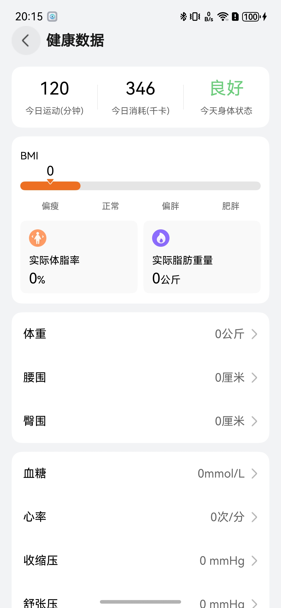 | 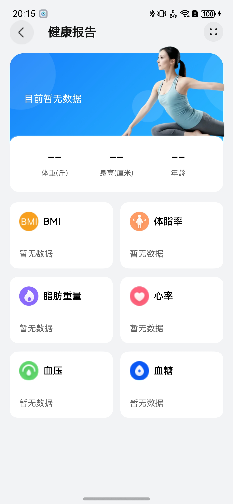 |

|                   健康知识列表页                   |                   健康知识详情页                   |                    消息中心页                    |
|:----------------------------------------:|:----------------------------------------:|:----------------------------------------:|
| 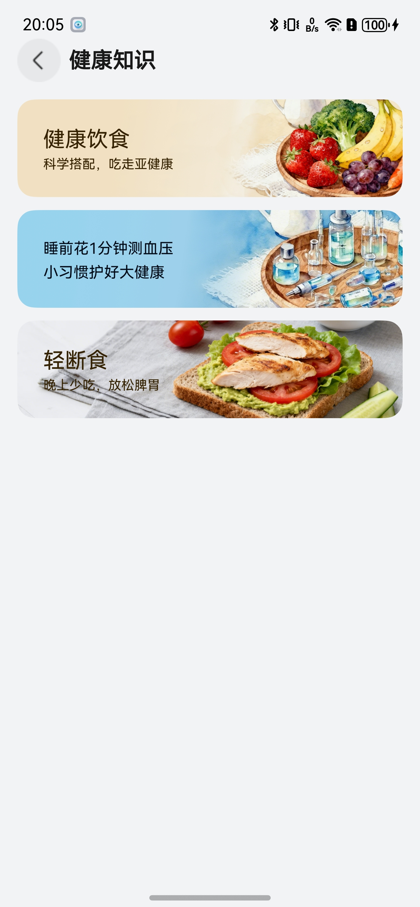 | 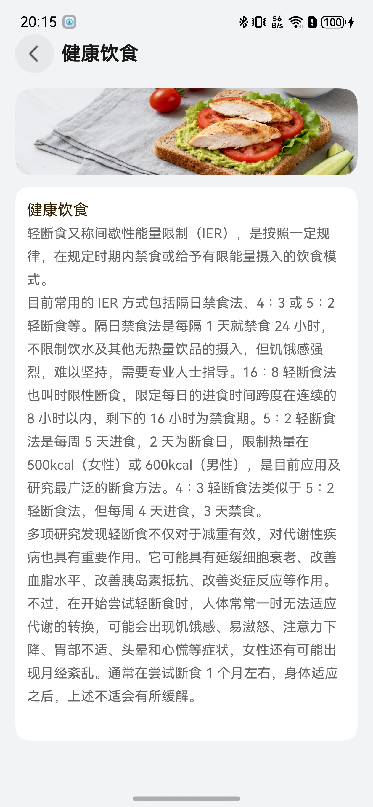 | 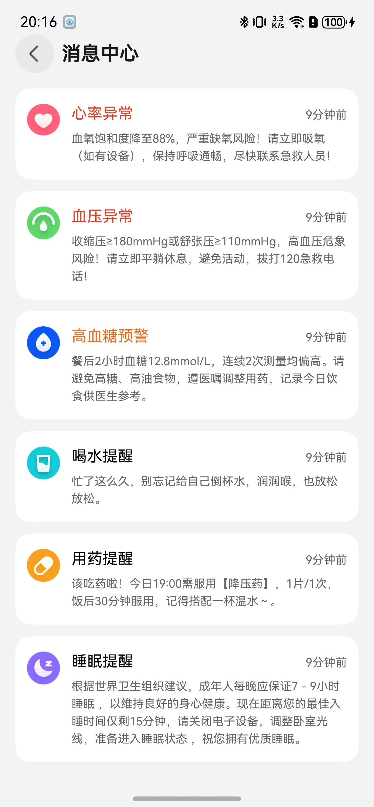 |

|                   步数详情页                   |                   血糖详情页                   |                    血压详情页                    |
|:----------------------------------------:|:----------------------------------------:|:----------------------------------------:|
| 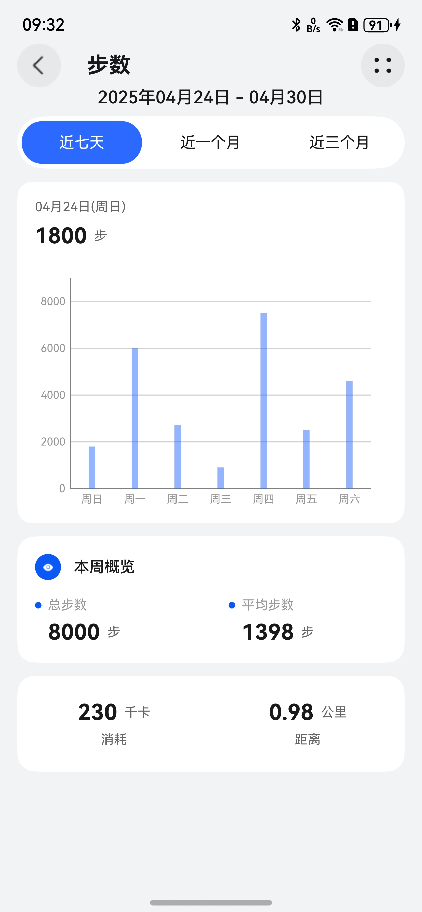 | 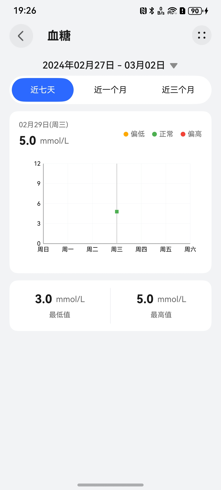 | 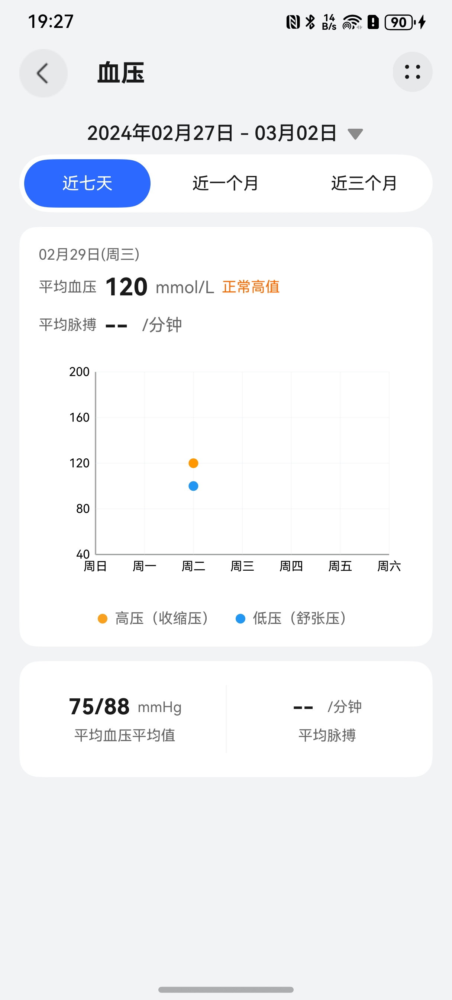 |

|                   心率详情页                   |                   睡眠详情页                   |
|:----------------------------------------:|:----------------------------------------:|
| 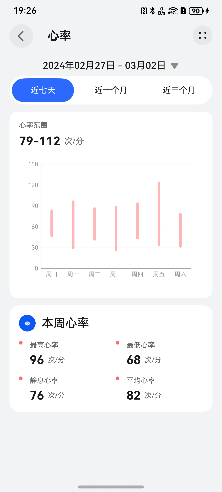 | 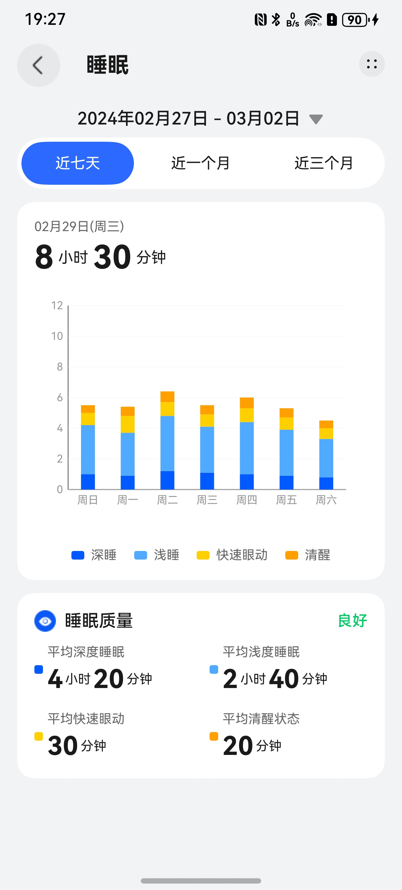 |

### 设备模块

|                   设备首页                   |                   设备扫描页                   |                    设备信息页                    |
|:----------------------------------------:|:----------------------------------------:|:----------------------------------------:|
|  | 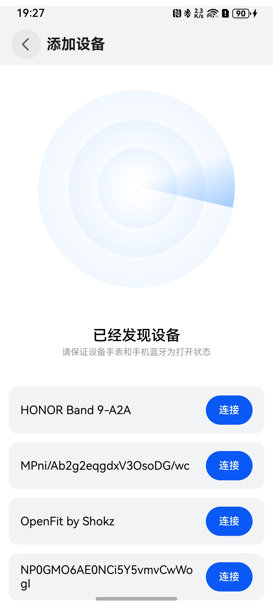 | 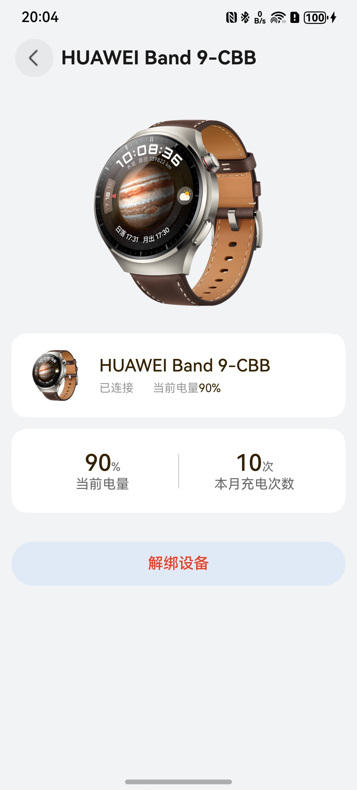 |

### 个人中心模块

|                   个人信息                   |                   问题反馈                   |                    设置                    |
|:----------------------------------------:|:----------------------------------------:|:----------------------------------------:|
| 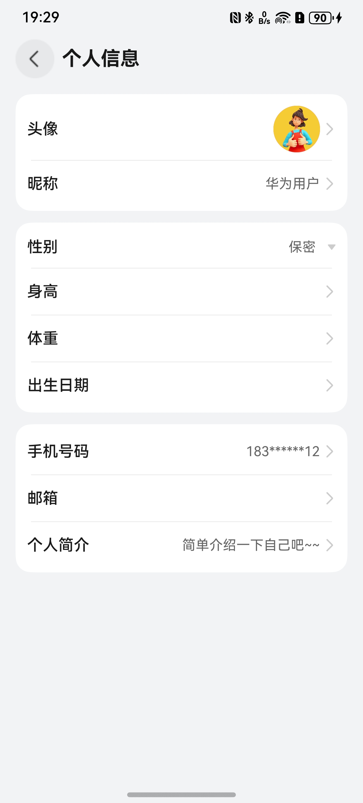 | 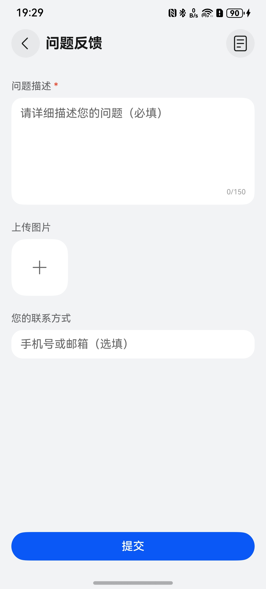 | 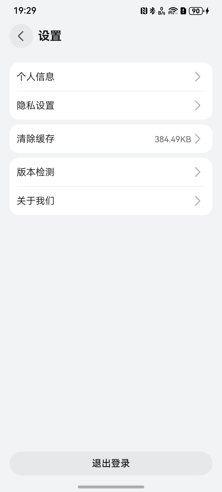 |

## 版本历史

| 版本 | 日期 | 主要变更 |
| --- | --- | --- |
| 1.6.0 | 2026-06-08 | 健康评分系统、连续打卡天数、健康建议、成就徽章、异常事件时间线、睡眠质量评分、BMI计算器、快捷入口 |
| 1.5.0 | 2026-06-08 | OHRouter导航栈修复、PreferenceUtil修复、监听器泄漏、TimeRangeButton提取、空catch修复、死代码清理 |
| 1.4.0 | 2026-06-08 | Bug修复（打卡状态、历史记录、Mock数据）、BMI异常提醒、饮水目标自定义、开发者选项面板 |
| 1.3.1 | 2026-06-07 | 打卡状态持久化修复、饮水打卡联动、喝水上限、弹窗自动关闭、ArkTS编译修复 |
| 1.3.0 | 2026-06-07 | 健康数据历史系统、喝水打卡、健康目标、知识搜索、数据导出、单元测试 |
| 1.2.0 | 2026-06-06 | 提醒服务模块化、我的收藏独立页面、弹窗打卡、定时器异常保护 |
| 1.1.0 | 2026-06-05 | 用药与饮水提醒、健康知识扩充至30篇、收藏功能、Mock数据优化、API 6兼容性修复 |
| 1.0.1 | - | 三方组件版本锁定、已知问题修复 |
| 1.0.0 | - | 初始版本，健康管理应用模板 |

详细变更记录请查看 [CHANGELOG.md](CHANGELOG.md)。

## 开源许可协议

该代码经过[Apache 2.0 授权许可](http://www.apache.org/licenses/LICENSE-2.0)。