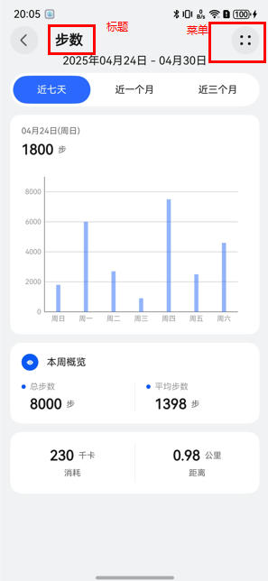
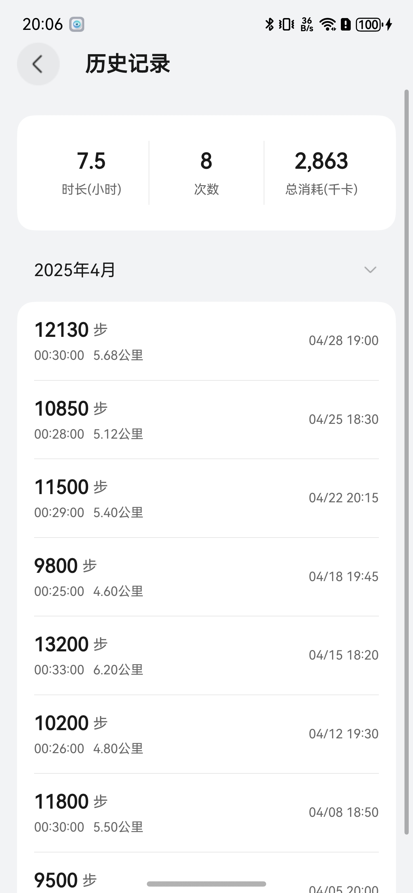

# 数据看板组件快速入门

## 目录
- [简介](#简介)
- [约束与限制](#约束与限制)
- [使用](#使用)
- [API参考](#API参考)
- [示例代码](#示例代码)

## 简介

本组件提供了健康数据可视化能力，用于展示步数、心率、血压、血糖、睡眠等健康数据。提供6种专业健康图表组件，基于@ohos/mpchart图表库实现，支持日/周/月视图切换，展示步数趋势和统计数据，按月份分组展示历史步数记录，自动计算平均值、最大值、最小值等统计指标，智能分析数据趋势。

| 步数看板界面 | 步数历史记录 |
|---------|---------|
|  |  |

## 约束与限制

### 环境

- DevEco Studio版本：DevEco Studio 5.0.5 Release及以上
- HarmonyOS SDK版本：HarmonyOS 5.0.3(15) Release SDK及以上
- 设备类型：华为手机（包括双折叠和阔折叠）
- 系统版本：HarmonyOS 5.0.3及以上

### 权限

无

## 使用

1. 安装组件。  
   如果是在DevEco Studio使用插件集成组件，则无需安装组件，请忽略此步骤。
   如果是从生态市场下载组件，请参考以下步骤安装组件。  
   a. 解压下载的组件包，将包中所有文件夹拷贝至您工程根目录的xxx目录下。  
   b. 在项目根目录build-profile.json5并添加data_dashboard模块。

   ```typescript
   // 在项目根目录的build-profile.json5填写data_dashboard路径。其中xxx为组件存在的目录名
   "modules": [
     {
       "name": "data_dashboard",
       "srcPath": "./xxx/data_dashboard",
     }
   ]
   ```
   c. 在项目根目录oh-package.json5中添加data_dashboard模块和mpchart图表库依赖。
   ```typescript
   // xxx为组件存放的目录名称
   "dependencies": {
     "data_dashboard": "file:./xxx/data_dashboard",
     // 图表库
     "@ohos/mpchart": "3.0.25"
   }
   ```
   
2. 引入组件。


3. 调用组件，详细参数配置说明参见[API参考](#API参考)。

   ```typescript
    Button('血压数据看板')
      .onClick(() => {
        this.pathStack.pushPathByName('BloodPressurePage', null);
      })
    Button('血糖数据看板')
      .onClick(() => {
        this.pathStack.pushPathByName('BloodGlucosePage', null);
      })
    Button('心率数据看板')
      .onClick(() => {
        this.pathStack.pushPathByName('HeartRatePage', null);
      })
    Button('睡眠数据看板')
      .onClick(() => {
        this.pathStack.pushPathByName('SleepPage', null);
      })
    Button('步数数据看板')
      .onClick(() => {
        this.pathStack.pushPathByName('StepCountPage', null);
      })
   ```

## API参考

### 接口

#### StepCountPageBuilder

StepCountPageBuilder()

步数数据可视化页面构建器，通过路由跳转使用。

#### StepHistoryPageBuilder

StepHistoryPageBuilder()

步数历史记录查看页面构建器，通过路由跳转使用。

#### ArcbarHealthStyleChart

ArcbarHealthStyleChart(options: { indicatorData: HealthIndicatorItem[]; arcWidth?: number; arcBackgroundColor?: string; arcGap?: number })

健康指标圆环图组件，展示多项健康指标。

**参数：**

| 参数名                 | 类型                                            | 是否必填 | 说明                      |
|---------------------|-----------------------------------------------|----|-------------------------|
| indicatorData       | [HealthIndicatorItem](#HealthIndicatorItem)[] | 是  | 指标数据数组                  |
| arcWidth            | number                                        | 否  | 圆环宽度，默认 26            |
| arcBackgroundColor  | string                                        | 否  | 圆环背景色，默认 '#F0E6E1'   |
| arcGap              | number                                        | 否  | 圆环间距，默认 8             |

#### ColumnHeartRateRangeChart

ColumnHeartRateRangeChart(options: { heartRateData: HeartRateRangeItem[]; highlightIndex?: number; normalColor?: string; highlightColor?: string })

心率区间柱状图组件，展示每日心率最小值与最大值区间。

**参数：**

| 参数名            | 类型                                          | 是否必填 | 说明                    |
|----------------|---------------------------------------------|----|------------------------|
| heartRateData  | [HeartRateRangeItem](#HeartRateRangeItem)[] | 是  | 心率数据数组                |
| highlightIndex | number                                      | 否  | 高亮索引，默认 -1          |
| normalColor    | string                                      | 否  | 普通颜色，默认 '#FFA6B8'   |
| highlightColor | string                                      | 否  | 高亮颜色，默认 '#FF7A45'   |

#### ColumnScrollbarChart

ColumnScrollbarChart(options: { stepData: StepCountItem[]; columnColor?: string; yAxisMax?: number })

步数柱状图组件，展示每日步数统计。

**参数：**

| 参数名         | 类型                                | 是否必填 | 说明                   |
|-------------|-----------------------------------|----|----------------------|
| stepData    | [StepCountItem](#StepCountItem)[] | 是  | 步数数据数组               |
| columnColor | string                            | 否  | 柱状颜色，默认 '#2B69FF' |
| yAxisMax    | number                            | 否  | Y轴最大值，默认 10000     |

#### ColumnSleepStackedChart

ColumnSleepStackedChart(options: { sleepData: SleepDataItem[]; deepColor?: string; lightColor?: string; remColor?: string; awakeColor?: string })

睡眠阶段堆叠图组件，展示深睡、浅睡、快速眼动、清醒时长。

**参数：**

| 参数名        | 类型                              | 是否必填 | 说明                   |
|------------|----------------------------------|-----|----------------------|
| sleepData  | [SleepDataItem](#SleepDataItem)[] | 是  | 睡眠数据数组               |
| deepColor  | string                           | 否  | 深睡颜色，默认 '#2F5BFF' |
| lightColor | string                           | 否  | 浅睡颜色，默认 '#49B6FF' |
| remColor   | string                           | 否  | 快速眼动颜色，默认 '#FFC04D'|
| awakeColor | string                           | 否  | 清醒颜色，默认 '#FF8F1F' |

#### MixBloodPressureChart

MixBloodPressureChart(options: { bloodPressureData: BloodPressureItem[]; systolicReference?: number; diastolicReference?: number; systolicColor?: string; diastolicColor?: string })

血压混合图表组件，展示收缩压/舒张压趋势及参考线。

**参数：**

| 参数名                 | 类型                                        | 是否必填 | 说明                    |
|---------------------|-------------------------------------------|----|------------------------|
| bloodPressureData   | [BloodPressureItem](#BloodPressureItem)[] | 是  | 血压数据数组                |
| systolicReference   | number                                    | 否  | 收缩压参考值，默认 135       |
| diastolicReference  | number                                    | 否  | 舒张压参考值，默认 95        |
| systolicColor       | string                                    | 否  | 收缩压颜色，默认 '#F28A2E'  |
| diastolicColor      | string                                    | 否  | 舒张压颜色，默认 '#2B69FF'  |

#### ScatterGlucoseChart

ScatterGlucoseChart(options: { glucoseData: GlucoseDataItem[]; lowColor?: string; normalColor?: string; highColor?: string })

血糖散点图组件，展示血糖水平及状态标识。

**参数：**

| 参数名         | 类型                                  | 是否必填 | 说明                   |
|-------------|--------------------------------------|----|----------------------|
| glucoseData | [GlucoseDataItem](#GlucoseDataItem)[] | 是  | 血糖数据数组               |
| lowColor    | string                               | 否  | 偏低颜色，默认 '#FAAD14' |
| normalColor | string                               | 否  | 正常颜色，默认 '#52C41A' |
| highColor   | string                               | 否  | 偏高颜色，默认 '#F5222D' |

### 数据模型

#### HealthIndicatorItem

健康指标数据项。

| 名称    | 类型     | 说明           |
|-------|--------|--------------|
| name  | string | 指标名称         |
| color | string | 指标颜色         |
| data  | number | 进度值（0-1 之间） |

#### HeartRateRangeItem

心率区间数据项。

| 名称      | 类型     | 说明       |
|---------|--------|----------|
| day     | string | 日期标签     |
| minRate | number | 最低心率值    |
| maxRate | number | 最高心率值    |

#### StepCountItem

步数数据项。

| 名称    | 类型     | 说明   |
|-------|--------|------|
| date  | string | 日期   |
| steps | number | 步数   |

#### SleepDataItem

睡眠数据项。

| 名称         | 类型     | 说明         |
|------------|--------|------------|
| date       | string | 日期         |
| deepSleep  | number | 深睡时长（分钟）   |
| lightSleep | number | 浅睡时长（分钟）   |
| remSleep   | number | 快速眼动时长（分钟） |
| awakeSleep | number | 清醒时长（分钟）   |

#### BloodPressureItem

血压数据项。

| 名称        | 类型     | 说明    |
|-----------|--------|-------|
| date      | string | 日期    |
| systolic  | number | 收缩压值  |
| diastolic | number | 舒张压值  |

#### GlucoseDataItem

血糖数据项。

| 名称      | 类型     | 说明                          |
|---------|--------|------------------------------|
| time    | string | 时间                          |
| value   | number | 血糖值                         |
| status  | string | 状态（'low'-偏低，'normal'-正常，'high'-偏高） |

## 示例代码

```typescript
@Entry
@ComponentV2
struct StepChartDemo {
   private pathStack: NavPathStack = new NavPathStack()

   build() {
      Navigation(this.pathStack) {
         Column({ space: 16 }) {
            Text('跳转数据看板页面')
               .fontSize(24)
               .fontWeight(FontWeight.Bold)
            Button('血压数据看板')
               .onClick(() => {
                  this.pathStack.pushPathByName('BloodPressurePage', null);
               })
            Button('血糖数据看板')
               .onClick(() => {
                  this.pathStack.pushPathByName('BloodGlucosePage', null);
               })
            Button('心率数据看板')
               .onClick(() => {
                  this.pathStack.pushPathByName('HeartRatePage', null);
               })
            Button('睡眠数据看板')
               .onClick(() => {
                  this.pathStack.pushPathByName('SleepPage', null);
               })
            Button('步数数据看板')
               .onClick(() => {
                  this.pathStack.pushPathByName('StepCountPage', null);
               })

         }
         .padding(16)
            .width('100%')
            .height('100%')
      }
      .mode(NavigationMode.Stack)
   }
}
```


